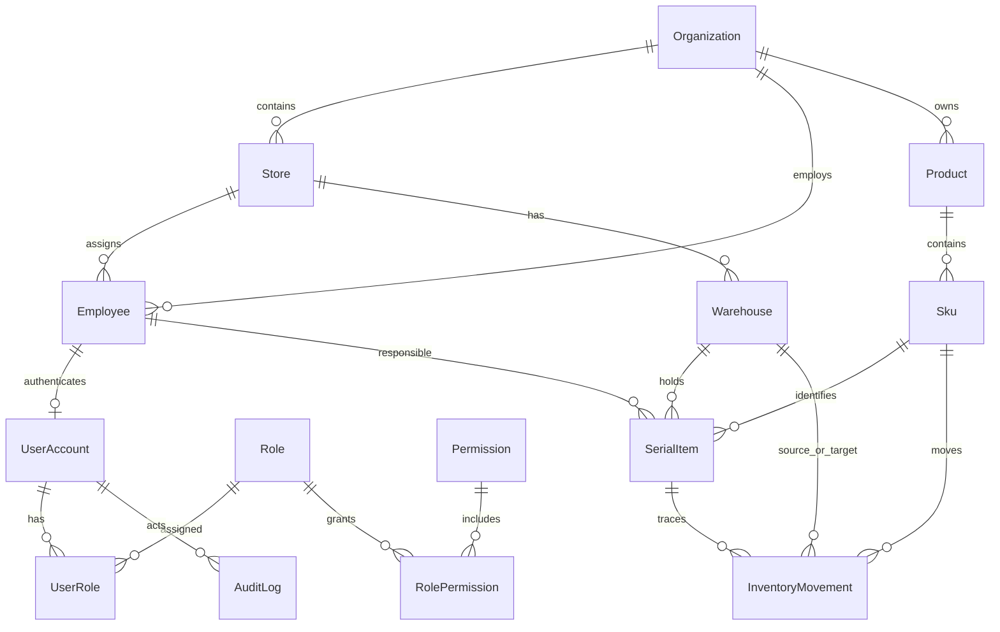

# 锦程 ERP Web 数据库 ER 图与数据字典

## 1. 当前状态

`packages/database/prisma/schema.prisma` 是当前数据库结构的唯一代码事实源。本文件解释已实现模型和计划实体；标为“计划”的表尚未进入迁移，不得假设已经存在。

## 2. 已实现核心关系

## 3. 已实现模型字典

| 模型 | 业务含义 | 关键约束/索引 |
|---|---|---|
| `Organization` | 公司/经营主体 | UUID 主键；关联门店、员工、商品 |
| `Store` | 门店 | 组织内编码唯一 |
| `Employee` | 员工与责任主体 | 组织内工号唯一；状态索引；可归属门店 |
| `UserAccount` | 登录账号 | 用户名唯一；员工一对一；支持冻结 |
| `Role` | 角色 | 角色编码唯一 |
| `Permission` | 资源动作权限 | 权限编码唯一 |
| `UserRole` | 用户角色及范围 | 用户+角色唯一；保存数据范围和审批额度 |
| `RolePermission` | 角色权限与字段策略 | 角色+权限唯一；字段策略为 JSON |
| `Product` | 商品型号主档 | 组织内商品编码唯一；品牌型号索引 |
| `Sku` | 可销售规格 | SKU 编码唯一；条码索引；标记是否序列号管理 |
| `Warehouse` | 公司、门店、个人、售后或异常库 | 仓库编码唯一；个人库负责人关系待补强 |
| `SerialItem` | 单机档案 | IMEI1/IMEI2/SN 非空时唯一；当前位置和责任人索引 |
| `InventoryMovement` | 不可变库存流水 | 必须关联来源单据；按 SKU/序列号/时间索引 |
| `AuditLog` | 操作审计 | 按资源、用户和时间查询；保存前后值 |
| `OutboxEvent` | 可靠事件发件箱 | 支持发布状态和重试；业务事务内写入 |

## 4. 计划业务实体

| 业务域 | 计划实体 | 冻结前提 |
|---|---|---|
| 库存 | `inventory_balance`、`stocktake_order/line`、`inventory_exception` | 数量单位、负库存、盘点审批 |
| 调拨 | `transfer_order/line`、`transfer_shipment`、`transfer_receipt`、`transfer_exception` | 状态机和部分收货规则 |
| 采购 | `supplier`、`purchase_order/line`、`purchase_payment`、`purchase_receipt`、`purchase_difference` | 税、费用分摊、超收/少收 |
| 销售 | `sales_order/line`、`sales_payment`、`sales_return`、`performance_allocation` | 销售流程、收款、毛利和业绩签字 |
| 客户 | `customer`、`customer_identity`、`followup_record`、`customer_merge_log` | 去重、合并和隐私策略 |
| 待办 | `task`、`approval_instance`、`business_event` | 业务动作与审批模板 |
| 集成 | `external_identity`、`sync_job`、`sync_item`、`raw_payload`、`dead_letter` | 平台 API 和数据保留策略 |
| 报表 | `daily_snapshot`、`metric_definition`、`export_job` | 指标口径和重算策略 |

## 5. 必须保持的数据不变量

1. 同一有效 IMEI/SN 只能对应一个单机档案和一个当前库存位置。
2. 库存余额只能由已生效库存流水产生；禁止业务代码直接修余额而不落流水。
3. 单据、库存流水、审计日志和 outbox 事件在同一事务内提交。
4. 金额使用定点小数；禁止使用浮点数保存金额。
5. 外部事实数据与人工补充字段分开保存，保留来源和导入批次。
6. 生效单据不物理删除；作废和冲销必须可追溯。
7. 所有跨组织/门店查询在数据库访问层应用数据范围。

## 6. 建模待办

- 为个人仓库补充 `ownerEmployee` 外键关系和“每名员工有效个人库唯一”约束。
- 决定数量库存余额采用同步汇总表还是物化视图，并配套重算工具。
- 为手机号、身份证件、账户等敏感字段制定加密、脱敏和检索方案。
- 确认软删除、停用和历史归档策略，避免唯一键被误复用。
- 每个新实体同时补充迁移、索引理由、保留周期和数据归属人。

