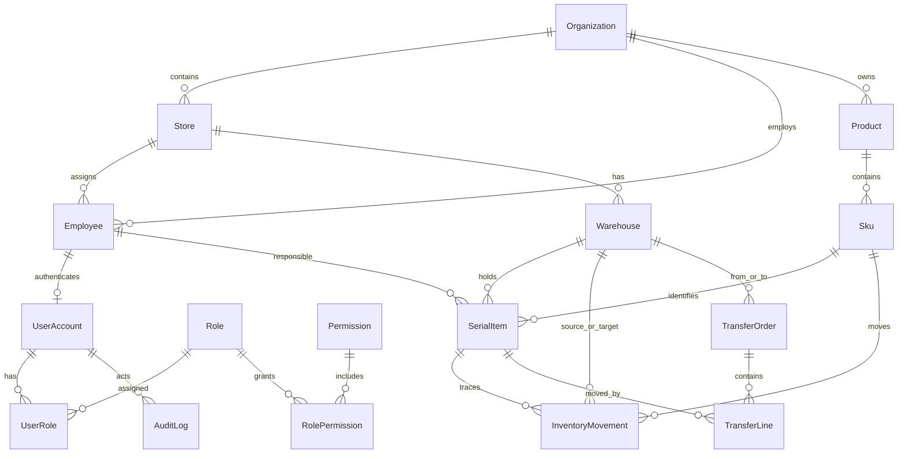

# 锦程 ERP Web 数据库 ER 图与数据字典

## 1. 当前状态

`packages/database/prisma/schema.prisma` 是当前数据库结构的唯一代码事实源。本文件解释已实现模型和计划实体；标为“计划”的表尚未进入迁移，不得假设已经存在。

## 2. 已实现核心关系

## 3. 已实现模型字典

| 模型                    | 业务含义                       | 关键约束/索引                                                                  |
| ----------------------- | ------------------------------ | ------------------------------------------------------------------------------ |
| `Organization`          | 公司/经营主体                  | UUID 主键；关联门店、员工、商品                                                |
| `Store`                 | 门店                           | 组织内编码唯一                                                                 |
| `Employee`              | 员工与责任主体                 | 组织内工号唯一；状态索引；可归属门店                                           |
| `UserAccount`           | 登录账号                       | 用户名唯一；员工一对一；支持冻结                                               |
| `Role`                  | 角色                           | 角色编码唯一                                                                   |
| `Permission`            | 资源动作权限                   | 权限编码唯一                                                                   |
| `UserRole`              | 用户角色及范围                 | 用户+角色唯一；保存数据范围和审批额度                                          |
| `RolePermission`        | 角色权限与字段策略             | 角色+权限唯一；字段策略为 JSON                                                 |
| `Product`               | 商品型号主档                   | 组织内商品编码唯一；支持启停；管家婆导入商品先标记为“待归类”，不猜测品牌和品类 |
| `Sku`                   | 可销售规格                     | SKU 编码唯一；支持名称、启停、颜色、容量和序列号管理标记                       |
| `SkuBarcode`            | SKU 多条码                     | 条码全局唯一；区分主条码和辅助条码                                             |
| `SkuExternalIdentity`   | 外部货品编码映射               | `source_system + source_id` 唯一；保留来源批次和原始字段摘要                   |
| `CatalogImportBatch`    | 货品导入批次                   | 内容哈希唯一；记录来源、采集时间、有效/错误行数和应用状态                      |
| `CatalogImportDocument` | 导入原始证据                   | 按批次保存原始 CDS/Excel 二进制；仅迁移服务可访问                              |
| `CatalogImportRow`      | 货品导入暂存行                 | 保留管家婆编码、名称、仓库、序列号、校验错误及最终商品/SKU 映射                |
| `Warehouse`             | 公司、门店、个人、售后或异常库 | 仓库编码唯一；个人库负责人关系待补强                                           |
| `SerialItem`            | 单机档案                       | IMEI1/IMEI2/SN 非空时唯一；当前位置和责任人索引                                |
| `InventoryMovement`     | 不可变库存流水                 | 必须关联来源单据；按 SKU/序列号/时间索引                                       |
| `TransferOrder`         | 调拨主单（docs/12 状态机）     | 单号唯一；按状态/调出仓/调入仓索引；操作人存 UserAccount.id 不建外键           |
| `TransferLine`          | 调拨明细（一机一行）           | (transferId, serialId) 唯一；差异类型与说明记录在行上                          |
| `StocktakeOrder`        | 盘点主单（整仓盘点）           | COUNTING/SUBMITTED/APPROVED 期间仓库封存；同仓不允许并存未完结盘点单           |
| `StocktakeScan`         | 盘点实盘扫描记录               | (stocktakeId, imei) 唯一；按主/副 IMEI 匹配序列号档案                          |
| `StocktakeDifference`   | 盘点差异快照                   | 盘亏 MISSING/盘盈串仓 UNEXPECTED；驳回重盘时清除重算，过账后固化               |
| `Supplier`              | 供应商主档                     | 编码唯一；status 复用 ProductStatus（ACTIVE/INACTIVE）                         |
| `PurchaseOrder`         | 采购主单（docs/12 第 3 节）    | 单号唯一；审批/付款/收货三维度独立枚举；paidAmount 为付款单据聚合缓存（同事务累加）；completedAt 非空即完成；操作人不建外键 |
| `PurchaseLine`          | 采购明细（SKU+数量）           | (purchaseOrderId, skuId) 唯一；receivedQuantity 由收货单据累加                 |
| `PurchasePayment`       | 采购付款单据                   | 资金变化由本单据驱动；按主单+付款时间索引                                      |
| `PurchaseReceipt`       | 采购收货批次                   | 批次号唯一（RCP- 前缀）；一次扫码收货一批                                      |
| `PurchaseReceiptItem`   | 采购收货明细（一机一行）       | serialId 指向收货时创建的 SerialItem（不建外键）；按批次/行/序列号索引         |
| `AuditLog`              | 操作审计                       | 按资源、用户和时间查询；保存前后值                                             |
| `OutboxEvent`           | 可靠事件发件箱                 | 支持发布状态和重试；业务事务内写入                                             |

## 4. 计划业务实体

| 业务域 | 计划实体                                                                                         | 冻结前提                       |
| ------ | ------------------------------------------------------------------------------------------------ | ------------------------------ |
| 库存   | 盘点已实现（`StocktakeOrder/Scan/Difference`，2026-08-12）；`inventory_balance`（数量库存）、`inventory_exception`（报损/找回单据）待做 | 数量单位、负库存、报损闭环     |
| 调拨   | 主单/明细已实现（`TransferOrder/Line`，2026-08-12）；差异处理单据 `transfer_exception_order` 待做 | 差异闭环与审批分级待签字       |
| 采购   | 主档与单据已实现（`Supplier`、`PurchaseOrder/Line`、`PurchasePayment`、`PurchaseReceipt(Item)`，2026-08-12）；差异单据 `purchase_difference` 待做 | 税、费用分摊、超收/少收容差待签字 |
| 销售   | `sales_order/line`、`sales_payment`、`sales_return`、`performance_allocation`                    | 销售流程、收款、毛利和业绩签字 |
| 客户   | `customer`、`customer_identity`、`followup_record`、`customer_merge_log`                         | 去重、合并和隐私策略           |
| 待办   | `task`、`approval_instance`、`business_event`                                                    | 业务动作与审批模板             |
| 集成   | `external_identity`、`sync_job`、`sync_item`、`raw_payload`、`dead_letter`                       | 平台 API 和数据保留策略        |
| 报表   | `daily_snapshot`、`metric_definition`、`export_job`                                              | 指标口径和重算策略             |

## 5. 必须保持的数据不变量

1. 同一有效 IMEI/SN 只能对应一个单机档案和一个当前库存位置。
2. 库存余额只能由已生效库存流水产生；禁止业务代码直接修余额而不落流水。
3. 单据、库存流水、审计日志和 outbox 事件在同一事务内提交。
4. 金额使用定点小数；禁止使用浮点数保存金额。
5. 外部事实数据与人工补充字段分开保存，保留来源和导入批次。
6. 生效单据不物理删除；作废和冲销必须可追溯。
7. 所有跨组织/门店查询在数据库访问层应用数据范围。

## 6. 建模待办

- 为个人仓库补充 `ownerEmployee` 外键关系和“每名员工有效个人库唯一”约束。
- 决定数量库存余额采用同步汇总表还是物化视图，并配套重算工具。
- 为手机号、身份证件、账户等敏感字段制定加密、脱敏和检索方案。
- 确认软删除、停用和历史归档策略，避免唯一键被误复用。
- 每个新实体同时补充迁移、索引理由、保留周期和数据归属人。

## 7. 管家婆货品导入边界

- 智储星已确认的管家婆序列号库存字段为：编号、商品全名、仓库编号/名称和序列号。
- 管家婆数据先进入 `CatalogImportBatch/CatalogImportRow` 暂存层，重复文件由内容哈希拦截。
- 编号和商品全名可用于建立“待归类”商品及 SKU；品牌、品类、颜色和容量未有独立字段时不得从名称硬猜。
- 仓库映射、单机成本和收货时间未确认前，不把暂存序列号直接写入 `SerialItem`，也不生成库存余额或库存流水。
- 每次应用导入批次必须与审计日志、outbox 事件在同一事务内提交。
