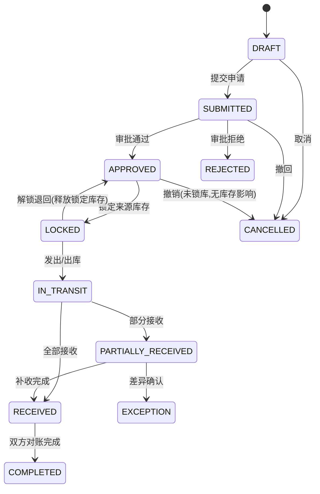
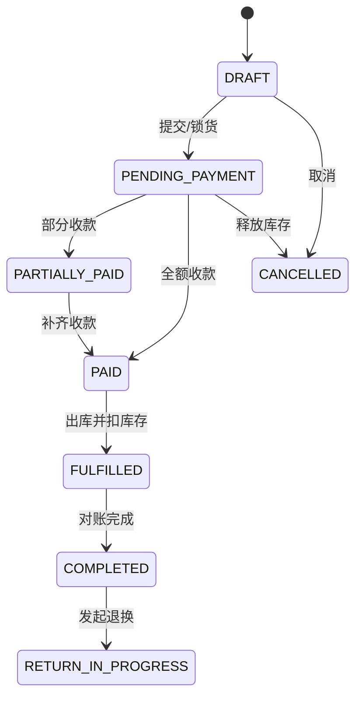
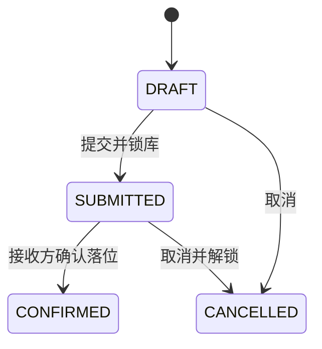

# 锦程 ERP Web 业务状态机与异常处理

## 1. 通用规则

- 状态转换由明确命令触发，记录操作者、时间、原因、前后状态和 request_id。
- 跳步、重复提交、越权、库存冲突和额度不足必须返回明确业务错误。
- 取消只允许在未产生不可逆后果前执行；已生效库存/资金使用冲销或反向单据。
- 主单完成必须由明细、库存、资金和异常的聚合结果决定，不能手工勾选“已完成”。

## 2. 调拨状态机

异常必须覆盖少货、错货、串号、损坏、拒收和超时未收；目标方确认前不得进入正常可售库存。

补充（2026-08-13）：锁定是可逆操作——发出前可「解锁退回」释放序列号（LOCKED → NORMAL，计数校验），单据回 APPROVED、明细行回 PENDING，之后可重新锁定或撤销；发出（IN_TRANSIT）后不可逆，只能走接收/差异流程。符合通用规则第 3 条「取消只允许在未产生不可逆后果前执行」。

## 3. 采购付款与收货

采购主单同时聚合审批、付款和收货三个维度：

- 审批：`DRAFT → SUBMITTED → APPROVED/REJECTED`。
- 付款：`UNPAID → PARTIALLY_PAID → PAID`，退款产生反向流水。
- 收货：`NOT_RECEIVED → PARTIALLY_RECEIVED → RECEIVED`，差异独立记录。
- 主单只有在终止条件满足且差异闭环后进入 `COMPLETED`。

付款和收货没有强制一一同步；系统必须持续显示已付未到、到货未付、超收、少收和错货。

## 4. 销售状态机（待业务签字）

必须确认：锁库存、扫码、确认收款、扣库存、开票/打印和完成的准确时点；未确认前只允许做原型和可逆接口草案。

## 5. 退换货状态机（待业务签字）

`REQUESTED → INSPECTING → APPROVED/REJECTED → GOODS_RECEIVED → REFUNDED/EXCHANGED → COMPLETED`。

- 必须关联原销售单、原明细、原序列号、原收款和原业绩分配。
- 退回商品需检查序列号、外观/激活/保修状态，再决定正常库、售后库或异常库。
- 退款、补差价、库存回入和业绩冲回应具备幂等与失败补偿。

## 6. 盘点与库存异常

- 盘点：`DRAFT → COUNTING → SUBMITTED → APPROVED → POSTED`（另有 `DRAFT/COUNTING → CANCELLED`、`SUBMITTED → COUNTING` 驳回重盘）。**已实现（2026-08-12）**。
- **冻结范围（已确认，2026-08-12 业务确认并实现）**：盘点按仓库整仓进行；开始盘点（COUNTING）起该仓库封存，直至过账（POSTED）或取消——封存期间禁止该仓一切库存变动：调拨建单/锁定/发出/接收、采购收货入库、个人库存领用/归还/转交均被系统拒绝（422），未来销售出库同样必须接入 `StocktakeFreezeService` 封存检查。同一仓库不允许并存未完结盘点单。
- 差异口径（已实现）：账面在库 = 当前位置在该仓且状态为 NORMAL/LOCKED/ABNORMAL（在途设备实物已发出，不计入基数）。盘亏（账面有实盘无）过账时设备转 ABNORMAL 并写 `STOCK_LOSS` 流水（留档不删）；盘盈/串仓（实盘有账面无或在他仓）仅记录差异清单，不自动建档或移仓。
- 待确认：盘点期间是否允许销售（销售模块上线前无实际影响）、复盘次数上限、盘亏后报损/找回单据流程、盘盈补录流程、差异审批分级。
- 盘盈盘亏、报损、借出、归还和售后出入库必须使用独立单据类型。
- 任何人工修复只能通过受控脚本或修正单据，禁止直接修改生产余额。

## 7. 离职交接

`ACTIVE → LEAVING → HANDOVER_IN_PROGRESS → INACTIVE`。个人库存、客户、在途单据、待办和审批责任未完成交接时，不得进入 `INACTIVE`；账号冻结后历史责任链仍保留。

## 8. 超时与补偿

- 对在途未收、采购差异、待审批和外部同步失败设置 SLA 与升级责任人。
- 外部调用失败通过 outbox/队列重试；超过阈值进入死信并产生待办。
- 业务事务成功但通知失败不得回滚业务事实；通知可重放。
- 每个异常必须有负责人、处理期限、处理结果和关闭人。

## 9. 个人库存状态机（AC-F-007，2026-08-16 已实现）

单据类型：

- 领用 `ISSUE`：门店仓/公司总仓 → 该员工个人仓。确认人：库管（`inventory:write`）。确认后序列号 `status=PERSONAL`，责任人=个人仓主人，流水 `PERSONAL_ISSUE`。
- 归还 `RETURN`：个人仓 → 门店仓/公司总仓。确认人：库管。确认后序列号 `status=NORMAL`，清空责任人，流水 `PERSONAL_RETURN`。
- 转交 `HANDOVER`：A 的个人仓 → B 的个人仓。确认人：**接收方本人**（`toEmployeeId`）。流水 `movementType=PERSONAL_ISSUE` 且 `documentType=PERSONAL_HANDOVER`（不新增 MovementType 枚举）。

规则：

- 提交即锁库（`NORMAL` 或 `PERSONAL` → `LOCKED`）；取消提交单时按行上 `lockedFromStatus` 原样恢复（兼容期初个人仓货物仍为 NORMAL）。
- 库存变化必须由本单据驱动，禁止直接改仓。
- 盘点封存中禁止提交与确认。
- 主单完成由确认命令一次性落全部明细（个人库存单不分批接收）。

