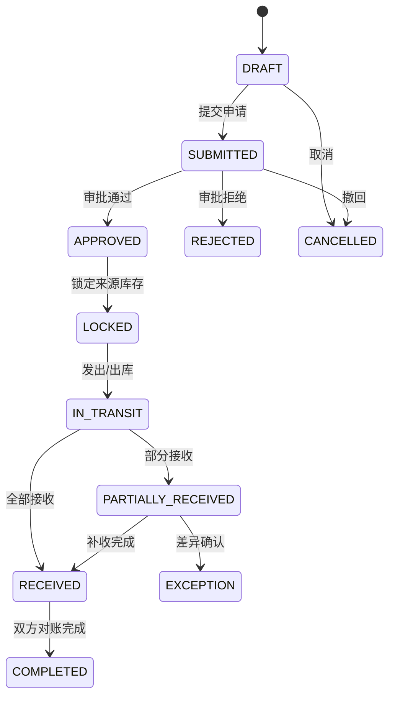
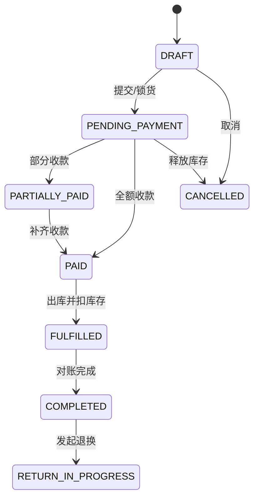

# 锦程 ERP Web 业务状态机与异常处理

## 1. 通用规则

- 状态转换由明确命令触发，记录操作者、时间、原因、前后状态和 request_id。
- 跳步、重复提交、越权、库存冲突和额度不足必须返回明确业务错误。
- 取消只允许在未产生不可逆后果前执行；已生效库存/资金使用冲销或反向单据。
- 主单完成必须由明细、库存、资金和异常的聚合结果决定，不能手工勾选“已完成”。

## 2. 调拨状态机

异常必须覆盖少货、错货、串号、损坏、拒收和超时未收；目标方确认前不得进入正常可售库存。

## 3. 采购付款与收货

采购主单同时聚合审批、付款和收货三个维度：

- 审批：`DRAFT → SUBMITTED → APPROVED/REJECTED`。
- 付款：`UNPAID → PARTIALLY_PAID → PAID`，退款产生反向流水。
- 收货：`NOT_RECEIVED → PARTIALLY_RECEIVED → RECEIVED`，差异独立记录。
- 主单只有在终止条件满足且差异闭环后进入 `COMPLETED`。

付款和收货没有强制一一同步；系统必须持续显示已付未到、到货未付、超收、少收和错货。

## 4. 销售状态机（待业务签字）

必须确认：锁库存、扫码、确认收款、扣库存、开票/打印和完成的准确时点；未确认前只允许做原型和可逆接口草案。

## 5. 退换货状态机（待业务签字）

`REQUESTED → INSPECTING → APPROVED/REJECTED → GOODS_RECEIVED → REFUNDED/EXCHANGED → COMPLETED`。

- 必须关联原销售单、原明细、原序列号、原收款和原业绩分配。
- 退回商品需检查序列号、外观/激活/保修状态，再决定正常库、售后库或异常库。
- 退款、补差价、库存回入和业绩冲回应具备幂等与失败补偿。

## 6. 盘点与库存异常

- 盘点：`DRAFT → COUNTING → SUBMITTED → APPROVED → POSTED`。
- 盘点期间的冻结范围、允许继续销售与否、复盘次数需要确认。
- 盘盈盘亏、报损、借出、归还和售后出入库必须使用独立单据类型。
- 任何人工修复只能通过受控脚本或修正单据，禁止直接修改生产余额。

## 7. 离职交接

`ACTIVE → LEAVING → HANDOVER_IN_PROGRESS → INACTIVE`。个人库存、客户、在途单据、待办和审批责任未完成交接时，不得进入 `INACTIVE`；账号冻结后历史责任链仍保留。

## 8. 超时与补偿

- 对在途未收、采购差异、待审批和外部同步失败设置 SLA 与升级责任人。
- 外部调用失败通过 outbox/队列重试；超过阈值进入死信并产生待办。
- 业务事务成功但通知失败不得回滚业务事实；通知可重放。
- 每个异常必须有负责人、处理期限、处理结果和关闭人。

